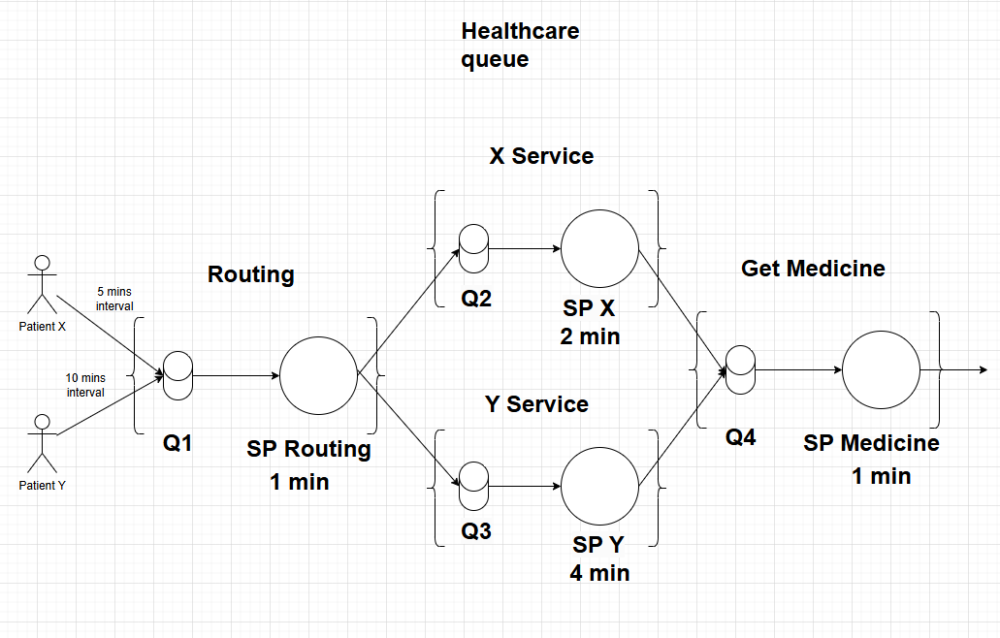
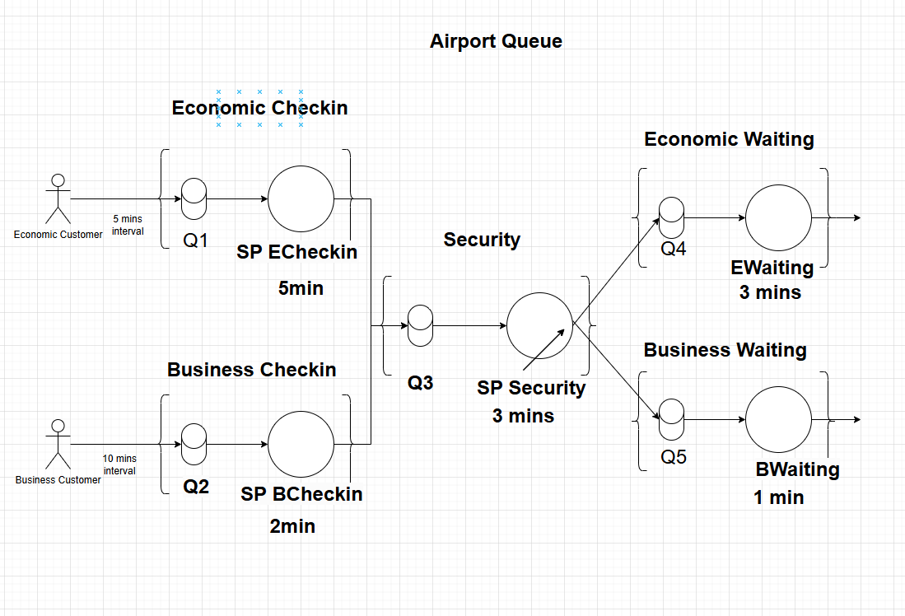

### (W) Design two different systems of three or four service points for a real-world destination. Use real-world concepts. Draw diagrams using the graphical representation of a service point shown in section ´Performance Variables´.

1. Health Centre 

   1. Description:
      - This is the diagram of Healthcare Center. In here, customers are arrived at set interval. When he/she is arrived, he/she will be reroute at Service Point Routing. Based on the type of the patient, he will go to X Service POint or Y Service Point. After the patient is served, he will go to Payment Service Point to do the payment.
   2. Explaination:
   - There are two type of customers: X, Y
     - X interval time: 5 mins
     - Y interval time: 10 mins
   - There are 4 service points:
     - Routing SP: take 1 min
     - X SP: take 2 mins
     - Y SP: take 4 mins
     - Payment SP: take 1 min
2. Airport Queue

   1. Description:
      - This is a diagram of Airport Queue. In here, customers are categorized as: Economic Customer and Business Customer. Based on that, the customer will be served in different checkin Service Point. Afterwards, the customer will go through the Security Service Point. After the security is done, the customer will be reroute to his/her waiting service point based on the customer's type.
   2. Explaination:
      - There are two type of customers: Economic, Business
        - Economic interval time: 10 mins
        - Business interval time: 5 mins
      - There are 5 service points:
        - Echecking SP: take 5 mins
        - Bchecking SP: take 2 mins
        - Security SP: take 3 mins
        - Ewaiting SP: take 5 mins
        - Bwaiting SP: take 2 mins